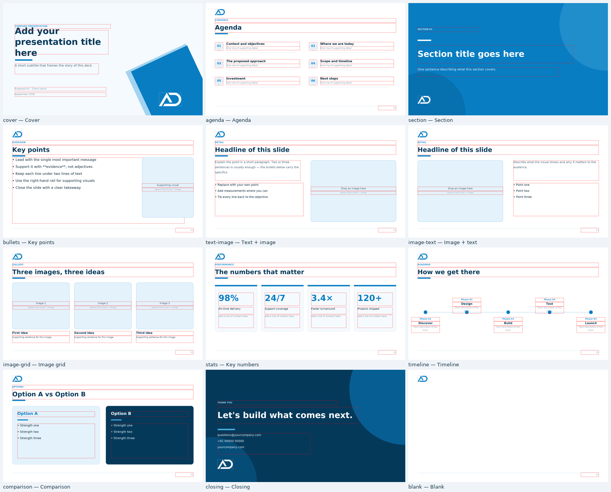

# ADPL Deck Studio — PPTX Maker

A browser-based PowerPoint builder for ADPL. Pick a sky-blue layout, type your content, drop in
images and position them exactly where you want them — then export a **real, fully editable
`.pptx`** file that opens in Microsoft PowerPoint, Google Slides and LibreOffice.

Everything runs in the browser — no backend, no account, and nothing you create is ever uploaded.



---

## Why it exists

Writing decks in PowerPoint means fighting the theme every time. This tool bakes the ADPL brand in
once — the logo, the sky-blue palette and the layout furniture — so anyone can assemble an
on-brand deck in minutes and still hand over a normal `.pptx` at the end.

## Features

**Slides & template**
- 12 ready layouts: Cover, Agenda, Section divider, Key points, Text + image, Image + text,
  Image grid, Key numbers, Timeline, Comparison, Closing, Blank
- One template, one palette — sky blue (`#097DC2`, sampled from the ADPL logo) with deep-navy and
  light-sky accents
- Apply a layout to an existing slide while **keeping the text you already typed**
- Duplicate, reorder (drag in the filmstrip), delete slides — speaker notes included
- Deck settings apply the logo / slide numbers to every slide in one click

**Images**
- Drag & drop files straight onto the canvas — the image lands where you drop it, scaled to fit
- Paste a screenshot with `Ctrl/⌘ + V`, or insert from the left rail / properties panel
- Move, resize (8 handles) and rotate freely (drag the round handle, hold `Shift` for 15° steps)
- Fit modes: **Fill** (crop), **Fit** (letterbox) or **Stretch**
- Corner radius, outline colour + width, opacity, alt text
- Uploads are downscaled automatically so exports stay fast
- Reuse any image already in the deck from the "Reuse from this deck" strip

**Text**
- Double-click any text on the canvas to edit it in place
- Rich runs inside one box: `**bold**`, `*italic*`, `__underline__`; start a line with `-` for bullets
- Font, size, bold/italic/underline, colour, alignment (H + V), line spacing, letter spacing,
  box padding, text-box fill
- One-click styles: Title / Subtitle / Body / Eyebrow
- A dashed warning appears when text grows taller than its box — resize it before exporting

**Shapes & layout skills**
- 16 autoshapes, fill/outline colours, opacity, dashes, rounded-corner control
- Smart guides: snap to slide margins, centres and other objects' edges/centres
- Multi-select via marquee drag or `Shift`-click, then align (6 ways) or distribute
- Arrange: bring to front / forward / backward / send to back
- Lock and hide objects, rename them for clarity
- Optional grid overlay, zoom 15 %–400 %, "Fit" view

**Export**
- **PowerPoint (.pptx)** — every element becomes a native Office object: editable text boxes,
  autoshapes and embedded pictures (no slide images). Includes a reusable `ADPL Sky Blue` slide
  master and speaker notes.
- **PNG** — a 2× raster of the current slide for chat/email
- **Project JSON** — save/reopen the whole deck, including embedded images

**Editing comfort**
- 90 steps of undo / redo (`Ctrl/⌘+Z`, `Ctrl/⌘+Shift+Z`), with each drag collapsed into one step
- Autosave to the browser (reopen the tab and your deck is still there)
- Copy / paste / duplicate objects (`Ctrl/⌘+C`, `Ctrl/⌘+V`, `Ctrl/⌘+D`), arrow-key nudging
  (`Shift` = bigger steps), `Delete` to remove, `Esc` to deselect
- Full-screen preview before exporting

## Quick start

```bash
npm install
npm run dev          # http://localhost:5173
```

Build a static bundle (any web host, or just open `dist/index.html` from a file share):

```bash
npm run build        # -> dist/
npm run preview      # serve the production build
```

Checks:

```bash
npm test             # typecheck + pptx pipeline test + component render test
```

## Deploying

The app is a plain static bundle, so any web host works (Netlify, Vercel, Cloudflare Pages, S3,
an internal IIS/Apache folder — just serve the contents of `dist/`).

### GitHub Pages — prepared, one switch left

A built copy of the site is already published on the **`gh-pages`** branch of this repository.
To make it live:

1. Open the repo → **Settings → Pages**
2. **Source:** *Deploy from a branch* · **Branch:** `gh-pages` · folder `/ (root)` → **Save**
3. After a minute or two the app is at
   `https://kulasekaran-adpl.github.io/PPTX-Maker/`

Publish new versions after any change:

```bash
npm run deploy      # runs the tests, builds, and pushes the gh-pages branch
```

The script is `scripts/deploy-gh-pages.sh` — it keeps `gh-pages` as an orphan branch containing
only build output, so the source history stays clean, and it is idempotent (re-running it with no
changes just says so).

Two things to be aware of before enabling it: GitHub Pages is only available on private
repositories for paid plans, and a Pages site is **publicly readable** even when the repository is
private. This tool has no secrets and never sends data anywhere, but the published bundle does
become public. Prefer to keep it internal? Deploy `dist/` to an internal host, or use
`npm run preview` on a shared machine instead.

### Continuous deployment (optional)

To build and deploy on every push instead of running `npm run deploy` by hand, copy
[`docs/deploy-cicd.yml`](docs/deploy-cicd.yml) to `.github/workflows/deploy-pages.yml` in the
repository (GitHub's web UI can create the file directly), then set
**Settings → Pages → Source: GitHub Actions**.

## Keyboard shortcuts

| Action | Shortcut |
| --- | --- |
| Undo / redo | `Ctrl/⌘ + Z` / `Ctrl/⌘ + Shift + Z` |
| Copy / paste / duplicate object | `Ctrl/⌘ + C` / `Ctrl/⌘ + V` / `Ctrl/⌘ + D` |
| Paste image from clipboard | `Ctrl/⌘ + V` (while an image is on the clipboard) |
| Select all objects on the slide | `Ctrl/⌘ + A` |
| Nudge 0.02″ / 0.15″ | Arrow keys / `Shift` + arrows |
| Resize proportionally | `Shift` + drag a corner handle |
| Rotate in 15° steps | `Shift` + drag the rotate handle |
| Delete selection | `Delete` / `Backspace` |
| Deselect / leave text editing | `Esc` |
| Save project to browser | `Ctrl/⌘ + S` |

## Project structure

```
src/
  App.tsx                  app shell (top bar · rail · canvas · properties)
  theme.ts                 brand tokens, swatches, fonts, slide presets
  types.ts                 document model (all geometry in inches)
  templates/skyBlue.ts     the 12 layouts + starter deck
  state/
    useHistory.ts          undo/redo with begin/live/end coalescing
    useStore.tsx           deck store: slides, elements, selection, media, shortcuts
  components/
    TopBar.tsx             deck title, undo/redo, export menu
    LeftRail.tsx           filmstrip + insert palette (image, brand, text, shapes)
    Canvas.tsx             drag / resize / rotate / snap / marquee / inline editing
    SlideView.tsx          a slide rendered at any scale (canvas + thumbnails + preview)
    ElementView.tsx        text, picture and autoshape rendering + shape glyphs
    Inspector.tsx          properties for the selection, slide and deck
    Preview.tsx            full-screen presenter check
    ui.tsx                 inputs, colour picker, tabs
  export/exportPptx.ts     deck -> .pptx (pptxgenjs) and slide -> PNG
scripts/deploy-gh-pages.sh build + publish the static site to the gh-pages branch
docs/deploy-cicd.yml       optional GitHub Actions workflow for automatic deploys
test/                      pptx pipeline test and server-render smoke test
```

### How the geometry stays honest

All positions and sizes are stored in **inches**, the same unit PowerPoint uses, so the on-screen
canvas and the exported file are 1:1 — what you see is what the recipient opens. The preview is
rendered from the same store that feeds the exporter; the exporter's only jobs are converting
colours, parsing rich text and translating shapes into Office objects.

### The sky-blue template

The palette is derived from the ADPL mark:

| Token | Hex | Used for |
| --- | --- | --- |
| Brand | `#097DC2` | primary fills, accent rules, numbers |
| Brand dark | `#05639B` | hover/pressed UI, dividers |
| Deep navy | `#05395A` | titles, closing slide background |
| Light sky | `#4FAEE0` | accents on sky/on dark |
| Sky 50–300 | `#F5FAFE` → `#A3D3EF` | tints, cards, rules, placeholder frames |
| Ink / Ink soft / Ink faint | `#0E2A3D` / `#4B6779` / `#8AA4B5` | body copy hierarchy |

Brand assets live in `public/logo/` (`adpl-logo-blue.png`, `-white.png`, `-navy.png`), generated
from the original `logo/adpl_logo.png` with the surrounding whitespace trimmed. The white version
is intended for the sky-blue and navy backgrounds.

## Known limits

- The canvas is the source of truth for text wrapping; very long paragraphs may need a size
  tweak after export. The dashed box warning flags anything that will not fit.
- Calibri ships with Office; on other systems the preview falls back to a metric-compatible
  substitute, so line breaks can differ slightly. The exported file still specifies Calibri.
- Charts, tables, SmartArt and video are not part of the tool yet.
- Decks are stored in this browser's `localStorage`; use **Save project** for a portable file.

## Roadmap ideas

Tables and simple charts · in-app chart data editing · deck-wide fonts/search-replace ·
PDF export · SharePoint/Drive save · a layout library for other company templates.
